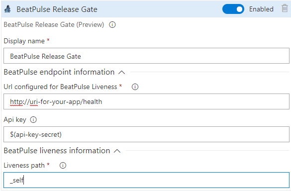

# BeatPulse VSTS Extensions

This package contains extensions which allows certain functionality of [**BeatPulse**](https://github.com/xabaril/beatpulse) Liveness library in VSTS.

## BeatPulse Deployment Gate

This Deployment Gate allows you to add a new Gate based on [**BeatPulse**](https://github.com/xabaril/beatpulse) Liveness.

### Prerequisites
To use this extension first you must configure **BeatPulse** in your desired application, to install it follow this [instructions](https://github.com/Xabaril/BeatPulse/blob/master/README.md)

Once installed and deployed, you can start use this extenstion to use liveness pulses as Release Gates

### Configuration

 

 To configure the extension you need to provide following parameters:
 - *Display name*: Name for the Release Gate.
 - *Url for BeatPulse*: Base path for your *BeatPulse* Liveness as configured in the application (i.e.: http://xabarildemo.com/hc).
 - *API Key*: if you are using an API Key to access *BeatPulse*, you should introduce it here. To keep it secret we recommend use a Secret Variable in your Release.
 - *Liveness path*: Path configured for the health check you want to perform with *BeatPulse*, it must be one of the configured in your application.

### More info on VSTS Deployment Gates
You can find general information about VSTS Deployment Gates [here](https://docs.microsoft.com/en-us/vsts/build-release/concepts/definitions/release/approvals/gates?view=vsts)
