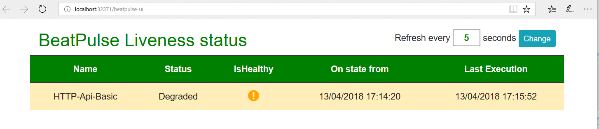

[](https://ci.appveyor.com/project/Xabaril/beatpulse) [](https://www.nuget.org/packages/BeatPulse/)

[](https://ci.appveyor.com/project/xabaril/beatpulse/history)

# Beat Pulse

Health checking is the process where load balancers or application delivery controller does periodic check on our applications to make sure that they are up and responding without any problems. If our applications are down for every reason or any of the system that our applications depends on (A database, a distributed cache, web service, ect) are down, the load balancer, k8s... should detect this and stop sending traffic its way and try to restore the services manually or automatically in case of k8s.

*BeatPulse* is a simple liveness, readiness library for .NET Core Applications. 

## What is the motivation behind it

The [Microsoft HealthCheck](https://github.com/dotnet-architecture/HealthChecks) library is not an active project right now and is not included  in ASP.NET Core 2.1.

## Getting Started

1. Install the Nuget Package into your ASP.NET Core application.

``` PowerShell
Install-Package BeatPulse
```

2. Install the liveness libraries that you need on your project. At this moment *BeatPulse* contains libraries for *Redis, SqlServer, MongoDb, Postgress Sql, Azure Storage (Blobs, Tables and Queues), DocumentDb, MySQL, SqLite,Kafka and custom lambda liveness*.

``` PowerShell
Install-Package BeatPulse.SqlServer
Install-Package BeatPulse.MongoDb
Install-Package BeatPulse.Npgsql
Install-Package BeatPulse.Redis
Install-Package BeatPulse.AzureStorage
Install-Package BeatPulse.MySql
Install-Package BeatPulse.DocumentDb
Install-Package BeatPulse.SqLite
Install-Package BeatPulse.Kafka
```

3. Add *BeatPulse* into your ASP.NET Core project. *UseBeatPulse* is a new IWebHostBuilder extension method to register and configure BeatPulse.

``` csharp
 public static IWebHost BuildWebHost(string[] args) =>
        WebHost.CreateDefaultBuilder(args)
               .UseBeatPulse(options=>
                {
                   options.SetAlternatePath("health") //default hc
                        .SetTimeout(milliseconds:1500) // default -1 infinitely
                        .EnableDetailedOutput(); //default false
                }).UseStartup<Startup>().Build();
```

4. Add *BeatPulseService* and set the liveness libraries to be used.

``` csharp
    services.AddBeatPulse(setup =>
    {
        //add custom liveness
        setup.Add(new ActionLiveness("cat", "catapi", async  httpContext =>
        {
            var httpClient = new HttpClient()
            {
                BaseAddress = new Uri("http://www.google.es")
            };

            var response = await httpClient.GetAsync(string.Empty);

            if (response.IsSuccessStatusCode)
            {
                return ("OK", true);
            }
            else
            {
                return ("the cat api is broken!", false);
            }
        }));

        //add sql server liveness
        setup.AddSqlServer("your-connection-string");
    });
```

5. Request *BeatPulse* to get liveness results.

For more information about *BeatPulse* configuration and other features ( cache, authentication... ) see the [specific documentation section.](./doc/beatpulse.md).

## UI

The project BeatPulse.UI is a minimal UI interface that store and shows the liveness results from the configured liveness uri's. To integrate BeatPulse.UI in your project you just need to add the BeatPulse.UI services and middlewares.

```csharp
    public class Startup
    {       
        public void ConfigureServices(IServiceCollection services)
        {
            services.AddBeatPulseUI();
        }

        public void Configure(IApplicationBuilder app, IHostingEnvironment env)
        {
            app.UseBeatPulseUI();
        }
    }
```

This automatically registers a new interface on **/beatpulse-ui**. Optionally, *UseBeatPulseUI* can be configured with different UI response path.



**BeatPulseUI** exist as *docker images* and * kubernetes helm*. You can read more about [beat pulse ui docker images](./doc/ui-docker.md) and [beat pulse ui helm](./doc/helm.md).

### Configuration

The liveness to be used on BeatPulse-UI are configured using the **BeatPulse-UI** settings.

```json
{
  "BeatPulse-UI": {
    "Liveness": [
      {
        "Name": "HTTP-Api-Basic",
        "Uri": "http://localhost:6457/health"
      }
    ],
    "WebHookNotificationUri": "",
    "EvaluationTimeOnSeconds": 10,
    "MinimunSecondsBetweenFailureNotifications":60
  }
}
```

    1.- Liveness: The collection of liveness uris to watch.
    2.- EvaluationTimeOnSeconds: Number of elapsed seconds between liveness checks.
    3.- WebHookNotificationUri: If any liveness return a *Down* result, this uri is used to notify the error status.
    4.- MinimunSecondsBetweenFailureNotifications: The minimun seconds between failure notifications in order not flooding the notification receiver.

All liveness results are stored into a SqLite database persisted to disk with *livenessdb* name.

### Notifications

If the **WebHookNotificationUri** is configured, BeatPulse-UI automatically post a new notification into this webhook. In the samples folders exist some **Azure Functions** to show howto recive the failure and send this using sms or mail transports.

```csharp
    
    #r "Twilio.API"

    using System;
    using System.Net;
    using Twilio;

    public static async Task Run(HttpRequestMessage req, IAsyncCollector<SMSMessage> message, TraceWriter log)

    {
        string messageContent = await req.Content.ReadAsStringAsync();

        log.Info($"Notifying: {messageContent} to configured phone number");

        var sms = new SMSMessage();
        sms.Body = messageContent;
        await message.AddAsync(sms);
    }

```

## Contributors

1. Unai Zorrilla Castro @unaizorrilla
2. Eduard Tomás @eiximenis
3. Carlos Landeras @carloslanderas
4. Luis Ruiz @lurumad
5. Hugo biarge @hbiarge
