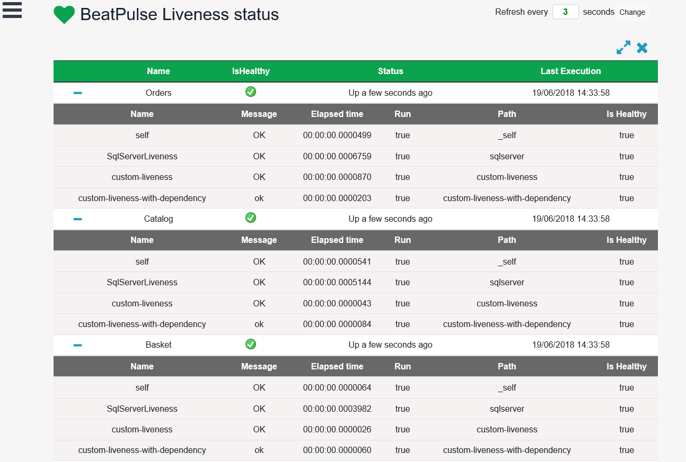

[](https://ci.appveyor.com/project/Xabaril/beatpulse) [](https://www.nuget.org/packages/BeatPulse/)

[](https://ci.appveyor.com/project/xabaril/beatpulse/history)

# Beat Pulse

> IMPORTANT UPDATE

Beatpulse project was created to fill a gap in Asp.Net Core ecosystem when no health checks libraries were available.

Now that Microsoft is rolling out their own [health checks integration](https://github.com/aspnet/Diagnostics),  the Beatpulse project will be focused in contributing towards this library.

All liveness, UI and Beatpulse features are already available as extensions for the new Microsoft health checks package in this repository:

[Xabaril - AspNetCore.Diagnostics.HealthChecks](https://github.com/Xabaril/AspNetCore.Diagnostics.HealthChecks)

**Support**

The team will continue to provide support to Beatpulse until version 3.0 with .Net Core version 2.1 but no new features will be added in this repository.


> What is Health Checking?

Health checking is the process where load balancers or application delivery controller does periodic checks on our applications to make sure that they are up and responding without any problems. If our applications are down for whatever reason or any of the systems that our applications depends on (A database, a distributed cache, web service, ect) are down, the load balancer, k8s, should detect this and stop sending traffic its way trying to restore services manually or automatically.

*BeatPulse* is a powerfull liveness, readiness library for .NET Core Applications with many out of box enterprise health check services.

## Getting Started 

> This documentation is for BeatPulse latest version, you can check changes and package compatibility on [ChangeLog](/doc/changelog.md).

1. Install the Nuget Package into your ASP.NET Core application.

``` PowerShell
Install-Package BeatPulse
```

2. Install the liveness libraries that you need on your project. At this moment *BeatPulse* contains NuGet libraries for:

 - System (Disk Storage, Memory)
 - Network (Tcp, Ftp, Sftp, Imap, Smtp, Dns resolve)
 - Redis
 - Elasticsearch
 - SqlServer
 - MongoDb
 - Postgress Sql
 - Oracle
 - Azure Storage (Blobs, Tables and Queues)
 - Azure Service Bus (Event Hub, Service Bus queues and topics)
 - DocumentDb
 - MySQL
 - SqLite
 - Kafka
 - RabbitMQ
 - Identity Server
 - AWS DynamoDB
 - Custom lambda liveness.

``` PowerShell
Install-Package BeatPulse.System
Install-Package BeatPulse.Network
Install-Package BeatPulse.SqlServer
Install-Package BeatPulse.MongoDb
Install-Package BeatPulse.Npgsql
Install-Package BeatPulse.Elasticsearch
Install-Package BeatPulse.Redis
Install-Package BeatPulse.AzureStorage
Install-Package BeatPulse.AzureServiceBus
Install-Package BeatPulse.MySql
Install-Package BeatPulse.DocumentDb
Install-Package BeatPulse.SqLite
Install-Package BeatPulse.Kafka
Install-Package BeatPulse.RabbitMQ
Install-Package BeatPulse.IdSvr
Install-Package BeatPulse.DynamoDB
Install-Package BeatPulse.Oracle
```

3. Add *BeatPulse* into your ASP.NET Core project. *UseBeatPulse* is a new IWebHostBuilder extension method to register and configure BeatPulse.

``` csharp
 public static IWebHost BuildWebHost(string[] args) =>
        WebHost.CreateDefaultBuilder(args)
               .UseBeatPulse(options=>
                {
                   options.ConfigurePath(path:"health") //default hc
                        .ConfigureTimeout(milliseconds:1500) // default -1 infinitely
                        .ConfigureDetailedOutput(detailedOutput:true,includeExceptionMessages:true); //default (true,false)
                }).UseStartup<Startup>().Build();
```

4. Add *BeatPulseService* and set the liveness libraries to be used.

``` csharp
    services.AddBeatPulse(setup =>
    {
        //add sql server liveness
        setup.AddSqlServer("your-connection-string");
    });
```

5. Request *BeatPulse* to get liveness results.

``` bash
curl http://your-domain/hc 
GET /hc HTTP/1.1
Host: your-domain
User-Agent: curl/7.49.0
Accept: */*
HTTP/1.1 200 OK
OK
```

For more information about *BeatPulse* configuration and other features ( configuration, cache, authentication, etc ) see the [specific documentation section](./doc/beatpulse.md).

## Tracking pulses

With *TrackingPulses* you can save liveness information in external services. Currently we have developed different trackers you can use:

 > [Application Insights Tracker](./doc/ai-tracker.md)

 > [Prometheus Tracker](./doc/prometheus_tracker.md)

 > [StatusPage Tracker](./doc/statuspage_tracker.md)


## UI

The project BeatPulse.UI is a minimal UI interface that stores and shows the liveness results from the configured liveness uri's. To integrate BeatPulse.UI in your project you just need to add the BeatPulse.UI services and middlewares.

```csharp
    public class Startup
    {       
        public void ConfigureServices(IServiceCollection services)
        {
            services.AddBeatPulseUI();
        }

        public void Configure(IApplicationBuilder app, IHostingEnvironment env)
        {
            app.UseBeatPulseUI();
        }
    }
```

This automatically registers a new interface on **/beatpulse-ui**. 

> Optionally, *UseBeatPulseUI* can be configured with different UI response path.



**BeatPulseUI** is also available as a *docker image*  You can read more about [beat pulse ui docker image](./doc/ui-docker.md).

### Configuration

The liveness to be used on BeatPulse-UI are configured using the **BeatPulse-UI** settings.

```json
{
  "BeatPulse-UI": {
    "Liveness": [
      {
        "Name": "HTTP-Api-Basic",
        "Uri": "http://localhost:6457/health?DetailedOutput=true"
      }
    ],
    "Webhooks": [
      {
        "Name": "",
        "Uri": "",
        "Payload": "",
        "RestoredPayload":""
      }
    ],
    "EvaluationTimeOnSeconds": 10,
    "MinimumSecondsBetweenFailureNotifications":60
  }
}
```

    1.- Liveness: The collection of liveness uris to watch.
    2.- EvaluationTimeOnSeconds: Number of elapsed seconds between liveness checks.
    3.- Webhooks: If any liveness return a *Down* result, this collections will be used to notify the error status. (Payload is the json payload and must be scape. For mor information see Notifications section)
    4.- MinimumSecondsBetweenFailureNotifications: The minimun seconds between failure notifications in order not flooding the notification receiver.

All liveness results are stored into a SqLite database persisted to disk with *livenessdb* name.

### Failure Notifications

If the **WebHooks** section is configured, BeatPulse-UI automatically posts a new notification into the webhook collection. BeatPulseUI uses a simple replace method for values in the webhook's **Payload** property. At this moment we support two bookmarks:

[[LIVENESS]] The name of the liveness that returns *Down*.

[[FAILURE]] A detail message with the failure.

The [web hooks section](./doc/webhooks.md) contains more information and webhooks samples for Microsoft Teams, Azure Functions, Slack and more.

## Contributing

BeatPulse wouldn't be possible without the time and effort of its contributors. The team is made up of Unai Zorrilla Castro @unaizorrilla, Luis Ruiz Pavón @lurumad, Carlos Landeras @carloslanderas and Eduard Tomás @eiximenis.

*Our valued committers are*: Hugo Biarge @hbiarge, Matt Channer @mattchanner, Luis Fraile @lfraile, Bradley Grainger @bgrainger.

If you want to contribute to a project and make it better, your help is very welcome. You can contribute with helpful bug reports, feature request and also new features with pull requests.

1. Read and follow the [Don't push your pull requests](https://www.igvita.com/2011/12/19/dont-push-your-pull-requests/)
2. Build.ps1 is working on local and AppVeyor.
3. Follow the code guidelines and conventions.
4. New features are not only code, tests and documentation are also mandatory.
