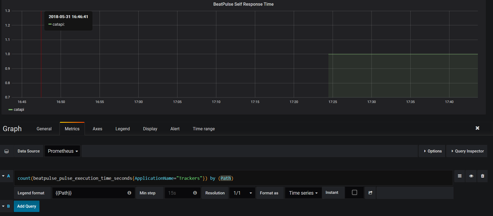

# Prometheus Tracker

## About Prometheus

[Prometheus](http://www.prometheus.io) is an open-source systems monitoring and alerting toolkit originally built at SoundCloud. Since its inception in 2012, many companies and organizations have adopted Prometheus, and the project has a very active developer and user community. It is now a standalone open source project and maintained independently of any company. To emphasize this, and to clarify the project's governance structure, Prometheus joined the Cloud Native Computing Foundation in 2016 as the second hosted project, after Kubernetes.

## Testing Prometheus tracker

In order to test our prometheus tracker on your local computer you can use the **docker compose** file on **samples\Prometheus-Stack-Environment**. When the compose is setting up a **Prometheus Database**, **Prometheus Tracker** and a **Grafana dashboard** is created and running.

> The *Prometheus* container is configured with two scrape jobs, a prometheus self scrape and the gateway scrape.

The *Tracker* project on samples directory contain a example of *Prometheus* tracker configured.

```csharp
    setup.AddPrometheusTracker(new Uri("http://localhost:9091"), new Dictionary<string, string>()
    {
        {"MachineName",Environment.MachineName}
    });
```

Now, you can use Grafana to create dashboards using the *BeatPulse* information. Browse to *http://localhost:3000* and create a new data source for *Prometheus*.

> Grafana use admin:admin as default credentials 


Add a new dashboard and create a graph panel with a **Prometheus** query over the new BeatPulse metrics.

    1.- beatpulse_pulse_excution_time_seconds
    2.- beatpulse_pulse_ishealthy



## Installation

``` Powershell
Install-Package BeatPulse.PrometheusTracker
```

## Configuration

```csharp
    public class Startup
    {       
        public void ConfigureServices(IServiceCollection services)
        {
            services.AddBeatPulse(setup =>
            {
                setup.AddPrometheusTracker(new Uri("http://prometheus-gateway-uri"));
            });
        }
    }
```
